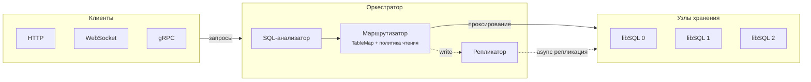

# Hive v2

Оркестратор для нескольких libSQL-мастеров. Принимает подключения по протоколам libSQL (Hrana HTTP, WebSocket, gRPC) и распределяет запросы между мастерами — каждая таблица принадлежит одному мастеру.

## Архитектура



## Что делает

- **Table-owner sharding** — каждая таблица закреплена за одним мастером, конфликты записи исключены
- **Прозрачное проксирование** — клиенты работают как с обычным libSQL
- **Политики чтения** — `write_master`, `round_robin`, `random`
- **Репликация** — SQL replay (Hrana) и raw gRPC forwarding, асинхронно
- **Turso Sync** — поддержка embedded replica через HTTP sync
- **Кросс-мастерные транзакции** — ленивый BEGIN + фан-аут COMMIT/ROLLBACK (опционально)
- **Один порт** — HTTP/1.1, WebSocket и gRPC (h2c) на :8080
- **4 прямых зависимости**, без фреймворков

## Протоколы

| Протокол | Эндпоинт | Описание |
|---|---|---|
| Hrana v1 | `POST /v1/execute`, `/v1/batch` | Stateless |
| Hrana v2 | `POST /v2/pipeline` | Baton-сессии |
| Hrana v3 | `POST /v3/pipeline`, `/v3/cursor` | Стриминг курсоров |
| WebSocket | `ws://…` (subprotocol `hrana3`) | Полный стриминг |
| gRPC | `/proxy.Proxy/Execute` | Embedded replica записи |
| WAL | `/wal_log.ReplicationLog/…` | Прокси к master[0] |
| Turso Sync | `/sync/…`, `/export/{gen}` | Python/Rust embedded replica |
| Служебные | `/health`, `/version`, `/dump` | Мониторинг и отладка |

## Быстрый старт

```bash
# Docker Compose — три мастера + оркестратор
docker compose up --build

# Или локально
cp config.example.yaml config.yaml
go build -o orchestrator ./cmd/orchestrator
./orchestrator config.yaml
```

Compose поднимает три libSQL-мастера (18080–18082) и оркестратор на 8080.

## Конфигурация

```yaml
listen_addr: ":8080"

masters:
  - url: "http://localhost:8081"
    token: "optional-auth-token"
  - url: "http://localhost:8082"

table_assignments:
  users: 0
  orders: 1

read_policy: "write_master"    # write_master | round_robin | random
stream_ttl: "10s"
max_body_bytes: 4194304

replication:
  workers: 4
  retry_max: 3
  retry_backoff: "1s"
  queue_capacity: 1024

transaction:
  cross_master_enabled: false
  commit_timeout: "30s"
```

## Подключение

```go
// go-libsql embedded replica
connector, _ := goLibsql.NewEmbeddedReplicaConnector("local.db", "http://localhost:8080")
db := sql.OpenDB(connector)
db.Exec("INSERT INTO orders (id, amount) VALUES (1, 100)")
```

```bash
# HTTP напрямую
curl -X POST http://localhost:8080/v1/execute \
  -H "Content-Type: application/json" \
  -d '{"stmt": {"sql": "SELECT 1"}}'
```

## Структура

```
cmd/orchestrator/       точка входа, DI, HTTP-сервер
internal/
├── config/             YAML-конфиг
├── dump/               агрегация дампов
├── grpcproxy/          gRPC proxy.Proxy
├── hrana/              Hrana HTTP сервер + клиент
├── replication/        асинхронная репликация
├── router/             маршрутизация + TableMap
├── sql/                SQL-анализатор
├── stream/             baton-менеджер
├── sync/               Turso Sync Protocol
├── transaction/        буфер кросс-мастерных транзакций
├── txlog/              WAL для crash recovery
└── ws/                 Hrana v3 WebSocket
```

## Тесты

```bash
go test ./...                              # юнит-тесты
cd ../test && go test -v ./e2e/...         # e2e (требует docker compose up)
```

## Ограничения

**Кросс-мастерные транзакции** — буферизованная симуляция 2PC, не полноценный распределённый протокол. Нет восстановления после сбоя оркестратора (возможна частичная фиксация). Read-your-writes гарантируется в пределах одного мастера, но не между мастерами до репликации.

**Репликация** — eventual consistency, есть задержка между записью и появлением на остальных мастерах.

**WAL-прокси** — embedded replica синхронизируются через master[0].

**Аутентификация** — на уровне оркестратора нет, токены пробрасываются мастерам.
